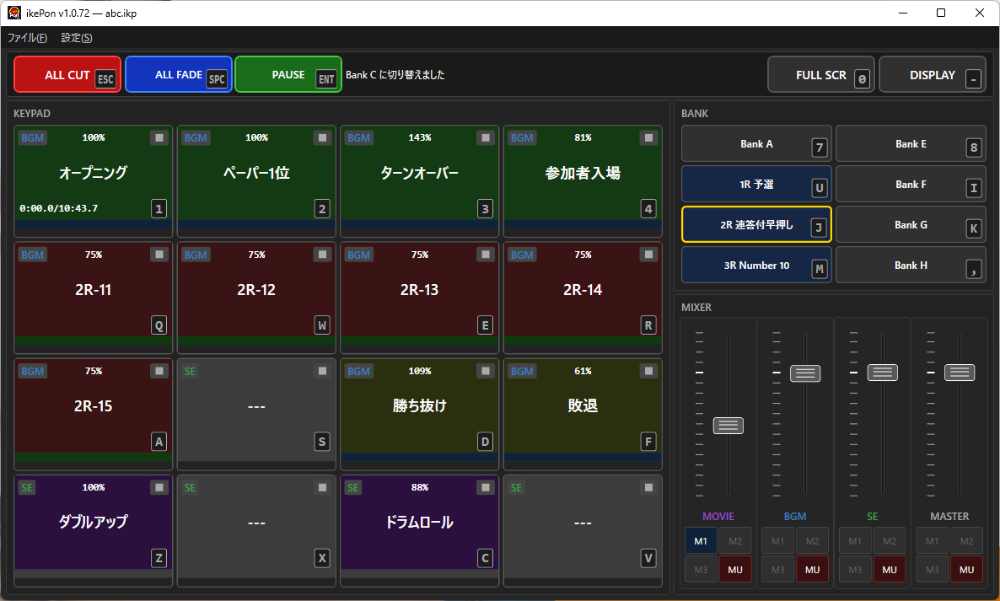
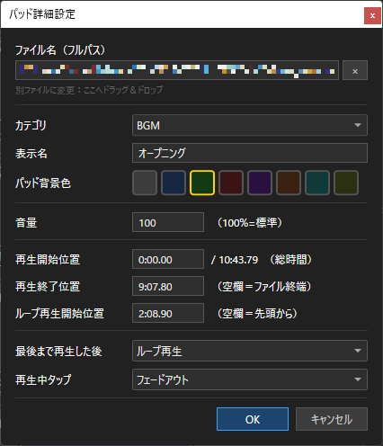
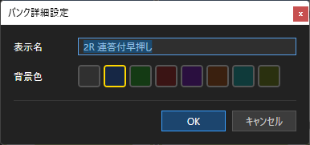
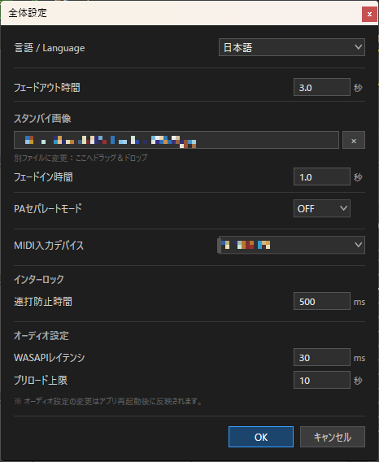
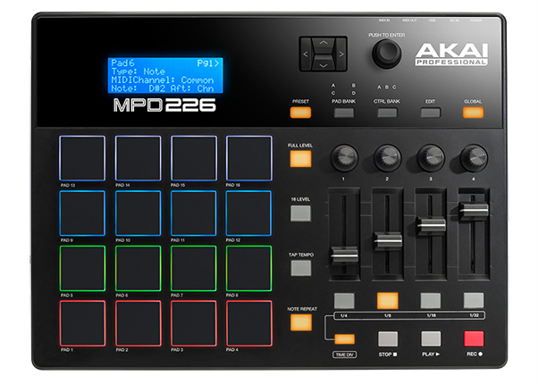

# ikePon v1.1 ユーザーマニュアル

---

## 1. アプリケーション概要

**ikePon** は、イベント・ステージ現場向けのポン出しアプリです。

- 最大 8 バンク × 16 パッド（計 128 ファイル）の登録に対応
- 動画・静止画の表示に対応
- パッド個別の音量調整が可能
- 動画、BGM、SE で個別に音量調整やループ設定が可能
- イベントで PA 側での音量調整がしやすいよう、BGM・動画と SE をそれぞれステレオ出力の L と R に割り振る PA セパレートモード搭載
- マウスでの操作、キーボードショートカットに加えて、MIDI コントローラーでの操作に対応

| 項目 | 仕様 |
|:---|:---|
| 対応 OS | Windows 10/11 x64 |
| 動作要件 | .NET 9 デスクトップランタイム（[ダウンロード](https://dotnet.microsoft.com/ja-jp/download/dotnet/9.0)） |
| 開発環境 | C# / WPF / .NET 9 |
| オーディオエンジン | NAudio（WASAPI Shared モード） |
| 映像エンジン | LibVLCSharp |
| プロジェクトファイル | `.ikp`（JSON 形式） |
| 設定ファイル | `%APPDATA%\ikePon\settings.json` |

---

## 2. 画面構成



画面は大きく **5 つのエリア** に分かれています。

| エリア | 場所 | 内容 |
|:---|:---|:---|
| メニューバー | 最上部 | ファイル操作・編集・設定 |
| グローバルエリア | メニュー直下 | ALL CUT / ALL FADE / PAUSE / LOCK / FULL SCR / DISPLAY の 6 ボタンとインフォメーション表示 |
| KEYPAD | 左側 | 4×4 パッドボタン（1 バンクあたり 16 個） |
| BANK | 右上 | バンク A〜H の切り替えボタン |
| MIXER | 右下 | MOVIE / BGM / SE / MASTER の 4 本フェーダー |

---

## 3. プロジェクトの管理

プロジェクトファイル（`.ikp`）に全パッドのファイル登録情報・バンク設定・ミキサー値を保存します。

| 操作 | メニュー | ショートカット |
|:---|:---|:---|
| 新規プロジェクト | ファイル → 新規プロジェクト | `Ctrl+N` |
| プロジェクトを開く | ファイル → 開く... | `Ctrl+O` |
| 上書き保存 | ファイル → 上書き保存 | `Ctrl+S` |
| 名前を付けて保存 | ファイル → 名前を付けて保存... | — |
| 元に戻す | 編集 → 元に戻す | `Ctrl+Z` |
| やり直し | 編集 → やり直し | `Ctrl+Y` |

**ヒント：** `.ikp` ファイルをメインウィンドウにドラッグ＆ドロップして開くことができます。また、拡張子ikpを関連付けすることにより、`.ikp` ファイルのダブルクリックで ikePon が起動してプロジェクトを直接読み込めます。

---

## 4. パッドの設定と登録

### 4.1 ファイルの登録

音声・動画・静止画ファイルを **パッドにドラッグ＆ドロップ** するか、パッドを **右クリック → 詳細設定...** でファイルを選択します。

対応フォーマット：

| 種別 | 拡張子 |
|:---|:---|
| 音声 | `.mp3` `.wav` `.flac` `.ogg` `.aac` `.m4a` |
| 動画 | `.mp4` `.mov` `.mkv` `.avi` `.wmv` |
| 静止画 | `.jpg` `.jpeg` `.png` `.bmp` `.gif` `.webp` `.tiff` `.tif` |

動画・静止画ファイルを登録すると、カテゴリが自動的に **MOV** に設定されます。

### 4.2 パッド詳細設定ダイアログ

パッドを **右クリック → 詳細設定...** で開きます。



| 項目 | 説明 |
|:---|:-----|
| ファイル名（フルパス） | 登録されているファイルのパス。別ファイルへの変更は D&D で可。`×` でクリア |
| カテゴリ | `BGM` / `SE` / `MOV` を選択 |
| 表示名 | パッド上に表示する名前（空欄ならファイル名） |
| パッド背景色 | 8 色から選択（初期値：ダークグレー） |
| 音量 | このパッドのみの音量（100% = 標準、0〜500%） |
| 再生開始位置 | 途中から再生する場合の開始タイムスタンプ。通常時は `0.00.00`  |
| 再生終了位置 | 途中で終了する場合のタイムスタンプ（空欄 = ファイル末尾） |
| ループ再生開始位置 | ループ時の折り返し先（空欄 = 先頭から） |
| 最後まで再生した後 | `そのまま終了` / `最終フレームで停止`（MOV のみ） / `ループ`（SE 以外） |
| 再生中タップ | `フェードアウト` / `カットアウト` / `一時停止・再開`（SE は選択不可） |

### 4.3「最後まで再生した後」の動作

| 設定 | 動作 |
|:---|:-----|
| そのまま終了 | 再生終了後、スタンバイ画像に戻る（BGM は無音になる） |
| 最終フレームで停止 | 最終フレームで静止して映像を表示し続ける（MOV のみ） |
| ループ | ループ再生開始位置（または先頭）に戻って繰り返す（SE 以外で有効） |

### 4.4 パッドの並べ替え（D&D 入れ替え）

アイドル状態のパッドをクリックしたままドラッグすると、別のパッドへ設定を丸ごと入れ替えることができます。LOCK ON 時は無効です。

### 4.5 パッドボタンの見方

```
┌────────────────────────────────────────┐
│ [BGM][●]  100%                     [■] │  ← カテゴリ / タップ設定 / 音量 / 再生後動作
│                                         │
│             ファイル名                   │  ← 表示名
│                                         │
│  0:00/ 1:23                         [1] │  ← 時間表示 / キーバッジ
│████████████████████ プログレスバー ████│  ← クリックでシーク
└────────────────────────────────────────┘
```

左上の **カテゴリバッジ** はパッドのカテゴリを示します：

| バッジ | カテゴリ |
|:---|:---|
| MOV | MOVIE（動画・静止画） |
| BGM | BGM（音楽・環境音など） |
| SE | SE（効果音：常に最初から再再生） |

カテゴリバッジの右の **●** は再生中タップ設定を示します（SE カテゴリ時は非表示）：

| ● の色 | 再生中タップ設定 |
|:---|:---|
| 赤 ● | カットアウト（即座に停止） |
| 青 ● | フェードアウト（デフォルト） |
| 緑 ● | 一時停止・再開（SE は選択不可） |

#### パッド枠のカラー状態

| 状態 | ボーダー色 | 意味 |
|:---|:---|:---|
| 待機中（Idle） | グレー | 再生待機 |
| 再生中（Playing） | 黄色 | 再生中 |
| フェードアウト中 | 黄色 → グレー補間 | フェードアウト中 |
| 一時停止中 | 黄色（じんわり点滅） | PAUSE 中 |
| 行方不明（Missing） | 赤点滅 | ファイルが見つからない |

#### 右クリックメニュー

**待機中のパッド：**

| メニュー項目 | 動作 |
|:---|:---|
| 詳細設定... | パッド詳細設定ダイアログを開く |
| コピー | パッドの全設定をコピー |
| ペースト | コピーした設定を貼り付け |
| 削除 | パッドの設定を初期化 |

**再生中のパッド：**

| メニュー項目 | 動作 |
|:---|:---|
| フェードアウト | フェードアウトして停止 |
| カットアウト | 即座に停止 |
| 一時停止／再開 | 一時停止・再開（SE カテゴリは無効） |

---

## 5. 再生操作

### 5.1 キーボードでの操作

パッドキーのレイアウトは以下のとおりです（キーボード上の位置に対応）。

```
 1   2   3   4    ← 上段（パッド 1〜4）
 Q   W   E   R    ← 2段目（パッド 5〜8）
 A   S   D   F    ← 3段目（パッド 9〜12）
 Z   X   C   V    ← 下段（パッド 13〜16）
```

### 5.2 再生中タップの動作

パッド詳細設定の **「再生中タップ」** によって、再生中のパッドを再度押したときの挙動が変わります。

| 設定 | MOVIE / BGM |
|:---|:---|
| フェードアウト（デフォルト） | フェードアウト停止 |
| カットアウト | 即座に停止 |
| 一時停止・再開 | 一時停止 → 再押しで再開 |

**SE カテゴリ：** 再生中タップの設定は選択不可です。SE は再生中に再度タップすると常に最初から再再生されます。

**同カテゴリの別パッドを再生した場合：** 旧パッドを即座に停止して新パッドを再生します。

### 5.3 プログレスバーによるシーク

再生中にパッド下部の **プログレスバー** をクリックすると、クリックした位置に即ジャンプします。音声と映像は同時にシークされます。

また、パッド左下の **時間表示** をドラッグ・ホイール操作することでもシークできます。

### 5.4 インターロック

同一パッドへの連打（デフォルト 500 ms 以内）は無視されます（設定で変更可）。

---

## 6. グローバル操作

### 6.1 ALL CUT（赤ボタン / `ESC`）

全パッドを即座に一括停止します。ボーダーが黄色にフラッシュし、動画も同時に停止します。

### 6.2 ALL FADE（青ボタン / `Space`）

再生中の全パッドをフェードアウトで停止します。再生中のパッドがない場合は何もしません。

### 6.3 PAUSE（緑ボタン / `Enter`）

MOVIE・BGM カテゴリの全再生中パッドを一時停止します（SE は対象外）。

- 一時停止中：PAUSEボタンのボーダーが黄色になり、一時停止中の各パッドがじんわり点滅
- もう一度押すと全パッドを再開（PAUSEボタンのボーダーが緑に戻る）
- 一時停止中に該当パッドの再生が終了した場合、PAUSE 状態は自動解除されます

### 6.4 LOCK（暗赤ボタン / `9` キー）

操作ロックをトグルします。ON 時はボーダーが黄色に変わります。

**LOCK ON 時に制限される操作：**

- パッドのカテゴリ変更・ループ設定変更・D&D 入れ替え・ファイルの D&D 割り当て
- アイドル状態のパッドの右クリックメニュー（再生中は右クリック可）
- バンクの D&D 入れ替え・右クリックメニュー
- FULL SCR・DISPLAY の変更

ミキサー部（フェーダー・MU・メモリ）は LOCK ON 中も操作できます。

### 6.5 FULL SCR（暗緑ボタン / `0` キー）

動画ウィンドウの全画面/ウィンドウモードをトグルします。操作後 1 秒間グレーアウトし、連打を防止します。LOCK ON 時は無効です。

### 6.6 DISPLAY（暗緑ボタン / `-` キー）

動画ウィンドウを表示・非表示でトグルします。操作後 3 秒間グレーアウトし、連打を防止します。LOCK ON 時は無効です。

- DISPLAY が **OFF** の状態でも動画・静止画パッドをトリガーできます（音声は通常通り再生）。DISPLAY を ON にすると映像が即座に表示されます

---

## 7. バンク（BANK）の使い方

### 7.1 バンクの構成

8 つのバンク（A〜H）がそれぞれ 16 個のパッドを持ちます。バンクキーのレイアウト：

```
 7   8    ← バンク A, E
 U   I    ← バンク B, F
 J   K    ← バンク C, G
 M   ,    ← バンク D, H  ※ カンマキー
```

現在選択中のバンクは **黄色のボーダー** でハイライトされます。

### 7.2 バンクの切り替え

- **再生中のパッドがない場合：** バンクキーを押すと即座に切り替わります
- **再生中のパッドがある場合：** 切り替えを拒否し、インフォメーションに「再生中のバンク切り替えは出来ません」と表示されます

### 7.3 バンクの並べ替え（D&D 入れ替え）

バンクボタンをクリックしたままドラッグすると、別のバンクへ内容を丸ごと入れ替えることができます。再生中のパッドがある場合は入れ替えできません。LOCK ON 時は無効です。

### 7.4 バンク詳細設定

バンクボタンを **右クリック → 詳細設定...** で開きます。



| 項目 | 説明 |
|:---|:---|
| 表示名 | バンクボタンに表示する名前 |
| 背景色 | バンクボタンの背景色（8 色から選択） |

### 7.5 バンク右クリックメニュー

| メニュー項目 | 動作 |
|:---|:---|
| 詳細設定... | バンク詳細設定ダイアログを開く |
| コピー | バンク詳細設定およびバンク内 16 パッドの全設定をコピー |
| ペースト | バンク詳細設定およびバンク内 16 パッドの全設定を貼り付け |
| 削除 | バンク詳細設定およびバンク内の全パッドを初期化（確認あり） |

---

## 8. ミキサー（MIXER）の使い方

4 本の縦フェーダーで各カテゴリの音量を調整します。

| フェーダー | カテゴリ | ラベル色 |
|:---|:---|:---|
| MOVIE | 動画・静止画 | 紫 |
| BGM | BGM | 青 |
| SE | SE | 緑 |
| MASTER | 全体 | グレー |

最終出力音量 = パッド音量 × カテゴリフェーダー × MASTER フェーダー

### 8.1 フェーダー操作

| 操作 | 動作 |
|:---|:---|
| ドラッグ | フェーダー値を変更（0〜127） |
| マウスホイール | 1 ステップずつ変更 |
| `Shift` + ホイール | 10 ステップずつ変更 |

スケール：`0` = 無音、`100` = ±0 dB（標準）、`127` = 最大（約 +2.1 dB）

### 8.2 メモリーボタン（M1〜M3）

各フェーダーに M1〜M3 の 3 つのメモリーボタンがあります。

| 操作 | 動作 |
|:---|:---|
| クリック（未登録） | 現在のフェーダー値を登録 |
| クリック（登録済み） | 記憶した値へフェード移動 |
| 右クリック | フェード移動 / 即座に移動 / 再登録 / 削除 |

### 8.3 MU ボタン（ミュート）

各フェーダー下の **MU** ボタンを押すとカテゴリをミュート（ボーダーが黄色で ON 状態を表示）します。

---

## 9. 動画ウィンドウ

### 9.1 ウィンドウ操作

- ウィンドウの位置・サイズはアプリ終了時に自動保存され、次回起動時に復元されます
- **ダブルクリック** でも全画面/ウィンドウモードのトグルができます

### 9.2 スタンバイ画像

映像が再生されていない間、設定したスタンバイ画像を表示できます（全体設定 → スタンバイ画像）。未設定の場合は黒画面になります。

### 9.3 黒画面検出

DISPLAY ON 中に、何らかのトラブルで映像もスタンバイ画像も表示されていない状態（黒画面）を検出した場合、インフォメーションエリアにオレンジ色の警告が表示されます。映像が復帰すると自動消去されます。

---

## 10. スマートリロケート（自動ファイル再リンク）

プロジェクトファイル読み込み時に素材ファイルが見つからない（ドライブ変更やフォルダ移動など）場合、**自動的に素材を再検索して再リンク** します。

### 10.1 自動探索（フェーズ 1）

次の場所を順番に自動検索します（最大 30 秒・10 万ファイルで打ち切り）。

1. プロジェクトファイルと同じフォルダおよびその全サブフォルダ
2. 前回ファイルを読み込んだフォルダ

インフォメーションエリアにリアルタイムで進捗が表示されます：

```
行方不明のファイルを自動再検索中... (2/5本)  フォルダ走査中...
```

自動探索が完了すると結果が表示されます：

```
3 本の行方不明ファイルを自動修復しました。
```

同名ファイルが複数見つかった場合、元のパスの **親フォルダ名** まで一致するものを優先します。

### 10.2 手動起点による一括解決（フェーズ 2）

自動探索で見つからないファイルがある場合、ダイアログが表示されます。**1 つのファイルを手動で指定** すると、そのフォルダを起点に残りのファイルも一括で再リンクを試みます。

### 10.3 行方不明ファイルの表示

最終的に再リンクできなかったパッドは **赤点滅のボーダー** と **[未リンク] バッジ** で表示され、再生は無効になります。

---

## 11. 設定ダイアログ（`Ctrl+E`）



| 項目 | 説明 | デフォルト |
|:---|:---|:---|
| フェードアウト時間 | パッド音声・映像のフェードアウト、フェーダーのフェード移動、ALL FADE のフェード秒数（共通） | 2.0 秒 |
| スタンバイ画像 | 動画ウィンドウの背景画像（D&D で設定、`×` でクリア） | なし（黒画面） |
| フェードイン時間 | スタンバイ画像の表示フェードイン時間 | 1.0 秒 |
| PAセパレートモード | ON にすると BGM+MOV → L チャンネル、SE → R チャンネルで出力 | OFF |
| MIDI 入力デバイス | MIDIコントローラーを選択（詳細は「13. MIDIコントロール機能」を参照） | なし（無効） |
| 連打防止時間 | 同一パッドの連打を無視する時間 | 500 ms |
| WASAPI レイテンシ | オーディオバッファサイズ（変更後は再起動が必要） | 30 ms |
| プリロード上限 | プリロードする最大ファイル長（変更後は再起動が必要） | 10 秒 |

---

## 12. キーボードショートカット一覧

### パッドキー

| キー | パッド番号 |
|:---|:---|
| `1` `2` `3` `4` | 1〜4 |
| `Q` `W` `E` `R` | 5〜8 |
| `A` `S` `D` `F` | 9〜12 |
| `Z` `X` `C` `V` | 13〜16 |

### バンクキー

| キー | バンク |
|:---|:---|
| `7` / `8` | A / E |
| `U` / `I` | B / F |
| `J` / `K` | C / G |
| `M` / `,` | D / H |

### アクションキー

| キー | 動作 |
|:---|:---|
| `ESC` | ALL CUT（全パッドを即座に停止） |
| `Space` | ALL FADE（全パッドをフェードアウト） |
| `Enter` | PAUSE ALL（MOVIE/BGM を一時停止・再開） |
| `9` | LOCK トグル |
| `0` | FULL SCR トグル |
| `-` | DISPLAY トグル |
| `Y` | 各種確認で YES |
| `N` | 各種確認で NO |

### メニューショートカット

| キー | 動作 |
|:---|:---|
| `Ctrl+N` | 新規プロジェクト |
| `Ctrl+O` | プロジェクトを開く |
| `Ctrl+S` | 上書き保存 |
| `Ctrl+Z` | 元に戻す |
| `Ctrl+Y` | やり直し |
| `Ctrl+E` | 設定ダイアログを開く |

---

## 13. MIDIコントロール機能

MIDIコントローラー（ドラムパッドやグリッドコントローラーなど）を接続することで、離れた場所からでもパッドのトリガーやミキサー操作をハンズフリーで行えます。舞台袖からのキュー出しや、大型コントローラーを使った演出操作に最適です。

### 13.1 MIDIデバイスの接続と設定

1. MIDIコントローラーを PC に USB 接続します
2. `Ctrl+E` で設定ダイアログを開きます
3. **「MIDI 入力デバイス」** のプルダウンから使用するデバイスを選択します

設定は自動的に保存されます。次回起動時も同じデバイスが選択されます。

> **ヒント：** MIDIコントローラーを抜き差しした場合は、設定ダイアログを一度閉じて開き直し、デバイスを再選択してください。

---

### 13.2 AKAI MPD226 での使用例

AKAI MPD226 のような 16 パッド（4×4）型コントローラーは、ikePon との相性が特に良好です。本体の **PAD BANK（A/B/C）** を切り替えることで、パッドトリガー・グローバル操作・ミキサー操作をすべて手元でコントロールできます。



| PAD BANK | 担当エリア | ノート番号 |
|:---|:---|:---|
| **PAD BANK A** | パッド 1〜16 のトリガー | 36〜51 |
| **PAD BANK B** | グローバル操作 ＆ バンク切り替え | 52〜67 |
| **PAD BANK C** | ミキサーのメモリ呼び出し ＆ ミュート | 68〜83 |

---

### 13.3 ノートマッピング詳細

#### PAD BANK A：パッドトリガー（ノート 36〜51）

MIDIコントローラーの 4×4 グリッドが、ikePon の 16 パッドに 1 対 1 で対応します。物理パッドの「**左下 = パッド 13**、**右上 = パッド 4**」という配置（多くのドラムパッドコントローラーの標準レイアウト）です。

```
[48:パッド 1 ][49:パッド 2 ][50:パッド 3 ][51:パッド 4 ]  ← 上段
[44:パッド 5 ][45:パッド 6 ][46:パッド 7 ][47:パッド 8 ]
[40:パッド 9 ][41:パッド10 ][42:パッド11 ][43:パッド12 ]
[36:パッド13 ][37:パッド14 ][38:パッド15 ][39:パッド16 ]  ← 下段
```

パッドを叩くと、キーボードのパッドキーを押したときと同じ動作をします。ベロシティ（強弱）は音量に影響しません。

#### PAD BANK B：グローバル操作 ＆ バンク切り替え（ノート 52〜67）

```
[64:BANK A  ][65:BANK B  ][66:BANK C  ][67:BANK D  ]  ← 上段（バンク A〜D）
[60:BANK E  ][61:BANK F  ][62:BANK G  ][63:BANK H  ]       （バンク E〜H）
[56:LOCK    ][57:FULL SCR][58:DISPLAY ][59:（予備） ]
[52:ALL CUT ][53:ALL FADE][54:PAUSE   ][55:（予備） ]  ← 下段
```

| ボタン | 動作 |
|:---|:---|
| ALL CUT（52） | 全パッドを即座に停止 |
| ALL FADE（53） | 全パッドをフェードアウトで停止 |
| PAUSE（54） | MOVIE/BGM を一時停止・再開 |
| LOCK（56） | 操作ロックのトグル |
| FULL SCR（57） | 動画ウィンドウの全画面トグル |
| DISPLAY（58） | 動画ウィンドウの表示／非表示トグル |
| BANK A〜H（64〜67, 60〜63） | バンクを切り替え |

#### PAD BANK C：ミキサー操作（ノート 68〜83）

各列が MOVIE / BGM / SE / MASTER の各フェーダーに対応します。

```
[80:MOVIE M1][81:BGM M1][82:SE M1][83:MASTER M1]  ← 上段（メモリ 1）
[76:MOVIE M2][77:BGM M2][78:SE M2][79:MASTER M2]       （メモリ 2）
[72:MOVIE M3][73:BGM M3][74:SE M3][75:MASTER M3]       （メモリ 3）
[68:MOVIE MU][69:BGM MU][70:SE MU][71:MASTER MU]  ← 下段（ミュート）
```

- **MU（ミュート）：** 該当チャンネルをミュート ON/OFF します
- **M1〜M3（メモリ）：** ミキサーの M1〜M3 ボタンと同じ動作をします（値を登録、または呼び出し）

---

### 13.4 CC（コントロールチェンジ）によるフェーダー操作

外部コントローラーの物理フェーダーやノブを使って、ikePon のミキサーフェーダーをリアルタイムに操作できます。

| CC 番号 | 対応フェーダー |
|:---|:---|
| CC 16 | MOVIE フェーダー |
| CC 17 | BGM フェーダー |
| CC 18 | SE フェーダー |
| CC 19 | MASTER フェーダー |

CC の値（0〜127）がそのままフェーダー値に反映されます（CC 値 100 = ±0 dB）。

> **MPD226 での設定例：** MPD226 のフェーダー 1〜4 を CC 16〜19 にアサインすると、アプリのミキサーを物理フェーダーで直接操作できます。CC アサインの変更は MPD226 本体の Edit モードで行います。

---

## 14. 更新履歴

| バージョン | 日付 | 内容 |
|:---|:---|:---|
| v1.1.0 | 2026-07-10 | 初回リリース |
